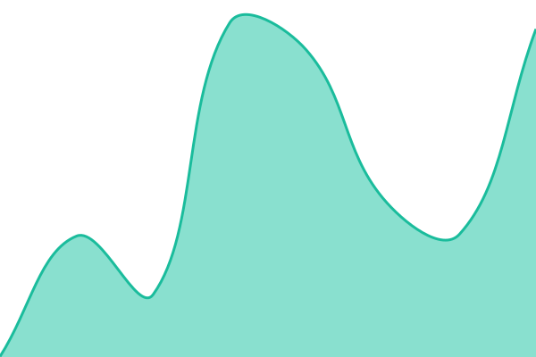
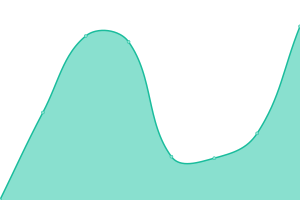

# [📈 Live Status](https://status.fan.my.id): <!--live status--> **🟩 All systems operational**

This repository contains the open-source uptime monitor and status page for [Fanz Irfan](https://status.fan.my.id), powered by [Upptime](https://github.com/upptime/upptime).

With [Upptime](https://upptime.js.org), you can get your own unlimited and free uptime monitor and status page, powered entirely by a GitHub repository. We use [Issues](https://github.com/fanzirfan/upptime/issues) as incident reports, [Actions](https://github.com/fanzirfan/upptime/actions) as uptime monitors, and [Pages](https://status.fan.my.id) for the status page.

<!--start: status pages-->
<!-- This summary is generated by Upptime (https://github.com/upptime/upptime) -->
<!-- Do not edit this manually, your changes will be overwritten -->
<!-- prettier-ignore -->
| URL | Status | History | Response Time | Uptime |
| --- | ------ | ------- | ------------- | ------ |
|  [Personal Website](https://www.fan.my.id/) | 🟩 Up | [personal-website.yml](https://github.com/fanzirfan/upptime/commits/HEAD/history/personal-website.yml) | 

 356ms
     
 | 

<a href="https://status.fan.my.id/history/personal-website">100.00%</a>
    

|  [KOJE ARCHIVE](https://arsip.manji.eu.org/) | 🟩 Up | [koje-archive.yml](https://github.com/fanzirfan/upptime/commits/HEAD/history/koje-archive.yml) | 

 266ms
     
 | 

<a href="https://status.fan.my.id/history/koje-archive">100.00%</a>
    

|  [SendTheLink](https://stl.manji.eu.org/) | 🟩 Up | [send-the-link.yml](https://github.com/fanzirfan/upptime/commits/HEAD/history/send-the-link.yml) | 

 825ms
     
 | 

<a href="https://status.fan.my.id/history/send-the-link">100.00%</a>
    

|  [Kita Tidak Akan Asing](https://kita.fan.my.id/) | 🟩 Up | [kita-tidak-akan-asing.yml](https://github.com/fanzirfan/upptime/commits/HEAD/history/kita-tidak-akan-asing.yml) | 

 349ms
     
 | 

<a href="https://status.fan.my.id/history/kita-tidak-akan-asing">100.00%</a>
    

|  [Cloudflare Email Pannel](https://app.madshin.eu.org/) | 🟩 Up | [cloudflare-email-pannel.yml](https://github.com/fanzirfan/upptime/commits/HEAD/history/cloudflare-email-pannel.yml) | 

 338ms
     
 | 

<a href="https://status.fan.my.id/history/cloudflare-email-pannel">100.00%</a>
    

|  [MyFinance](https://duit.fan.my.id/) | 🟩 Up | [my-finance.yml](https://github.com/fanzirfan/upptime/commits/HEAD/history/my-finance.yml) | 

 745ms
     
 | 

<a href="https://status.fan.my.id/history/my-finance">100.00%</a>
    

<!--end: status pages-->

[**Visit our status website →**](https://status.fan.my.id)

## 📄 License

- Powered by: [Upptime](https://github.com/upptime/upptime)
- Code: [MIT](./LICENSE) © [Anand Chowdhary](https://anandchowdhary.com), supported by [Pabio](https://pabio.com)
- Data in the `./history` directory: [Open Database License](https://opendatacommons.org/licenses/odbl/1-0/)
